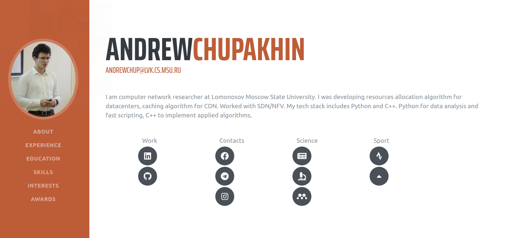

# Portfolio

The hosted version of this repository is live at [link](link)

## Steps to run locally
1. Clone the repository using `git clone https://github.com/andxeg/andxeg.github.io.git`
2. `cd` into the cloned repository and run `yarn`. This will install all the dependencies required for the project.
3. Run the server using `yarn start`.

## References
The tutorial for this portfolio is at [here](https://levelup.gitconnected.com/create-a-portfolio-using-react-and-github-student-developer-pack-955379207855)

This project was bootstrapped with [Create React App](https://github.com/facebook/create-react-app).
The Bootstrap template used in this tutorial is [https://github.com/BlackrockDigital/startbootstrap-resume](https://github.com/BlackrockDigital/startbootstrap-resume)
